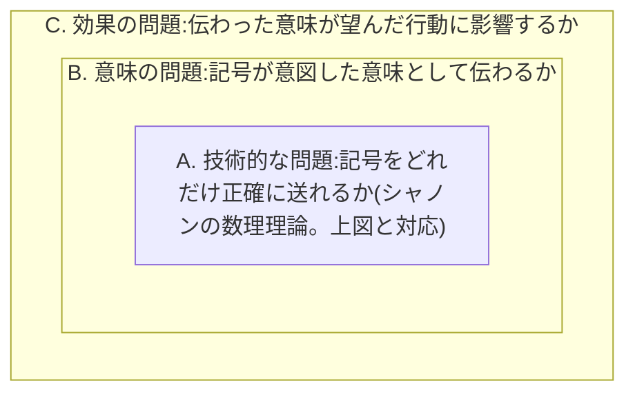
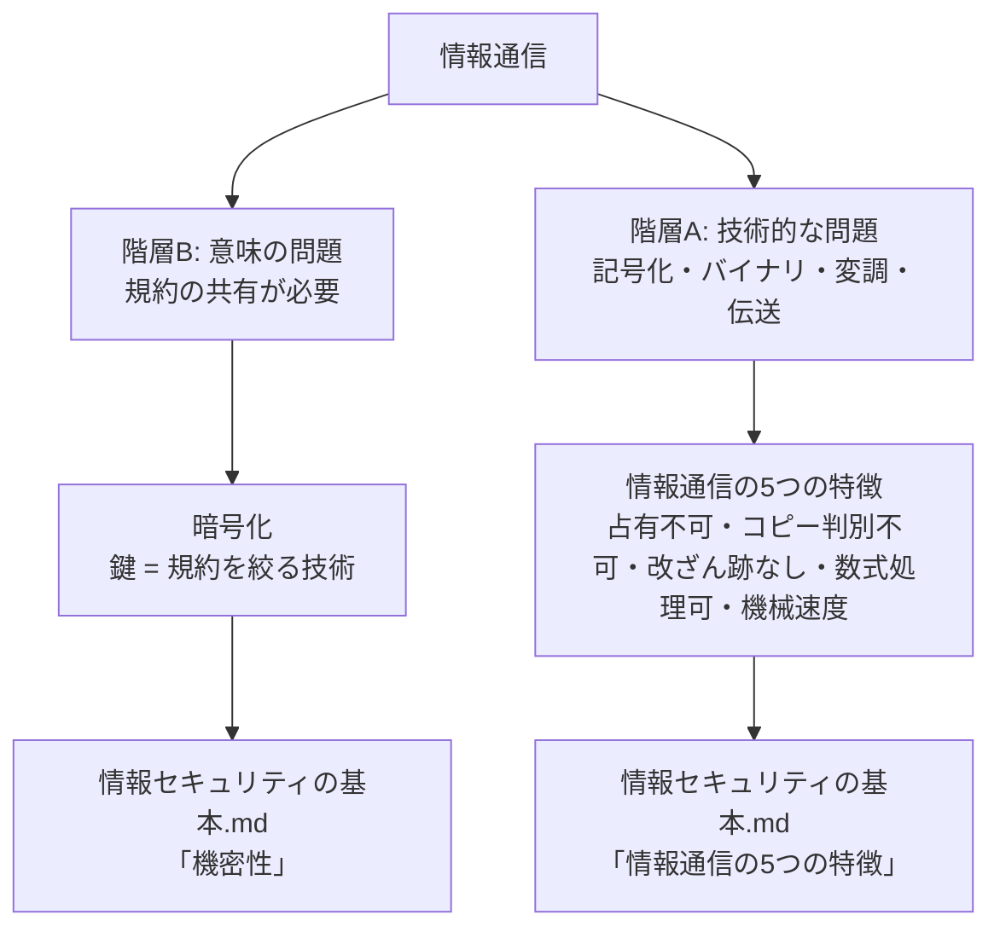

# 情報と通信の基礎

- カテゴリ: 情報工学
- 最終更新: 2026-06-20

---

## 通信には2つの階層がある

これは思いつきの分類ではなく、情報理論の出典がある、確立された枠組み。

クロード・シャノンが1948年に発表した論文「A Mathematical Theory of Communication」(Bell System Technical Journal)が、現在のデジタル通信工学(符号化、伝送、圧縮、誤り訂正など)すべての土台になっている、事実上の標準理論。シャノンの理論は、情報源が何を意味しているか(「猫がいる」など)を一切考えず、送信機から受信機まで記号をどれだけ正確に・効率よく送れるかだけを数式で扱った。図にすると次のような構造。

この図の「通信路」に必ず雑音が入る、という前提を置き、雑音があっても元の記号をどれだけ正確に復元できるかを数式で扱ったのがシャノンの理論。ここから「ビット」という単位、エントロピー、通信路容量(チャンネルキャパシティ)といった概念が生まれた。

この論文が1949年に書籍化された際、序文を書いた数学者ウォーレン・ウィーバーが、通信という行為には実は3段階の別の問題が含まれている、という整理を示した。これは「シャノン=ウィーバーモデル」として、今も通信理論・情報理論の教科書で最初に紹介される基本的な枠組みになっている。

| 階層 | 問題 | 何を扱うか |
|---|---|---|
| A. 技術的な問題 | 記号をどれだけ正確に送れるか | ノイズ、伝送速度、符号化方式など |
| B. 意味の問題 | 送られた記号が、意図した意味として正確に伝わるか | 規約(コード)の共有、言語、解釈 |
| C. 効果の問題 | 伝わった意味が、望んだ通りに相手の行動に影響するか | 説得力、伝え方の効果など |

3つの階層は、互いに無関係に並んでいるのではなく、後の階層が前の階層を内包する入れ子構造になっている。

シャノン自身の数理理論(階層A、エントロピー・通信路容量・ビットという単位など)は、デジタル通信工学において事実上異論のない基礎理論として扱われている。一方、階層B・Cを含めた3階層全体の枠組みは、通信理論・メディア論の入門で必ず触れられる古典的な整理だが、その後の研究者から「フィードバックや文脈を扱えない」といった拡張・批判も受けている。それでも、通信という行為を分解して理解するための標準的な出発点であることに変わりはない。

このドキュメントは、階層Aと階層Bの基礎をそれぞれ整理する。階層Aは[情報セキュリティの基本](../セキュリティ/情報セキュリティの基本.md)で扱う「情報通信の5つの特徴」の前提になり、階層Bは同じドキュメントの「暗号化(鍵=規約を絞る技術)」の前提になる。

---

## 階層B:意味の問題 — 規約の共有

### 情報は媒体と分離できる。ただし、それには「規約の共有」という前提条件がある

「猫がいる」という情報は、声で話しても、紙に書いても、電気信号にしても、同じ情報として伝わる。これは、情報の中身(意味)が、それを運ぶ物理的な手段(媒体)とは別物であることを示している。情報は媒体と分離できる。

ただし、この分離が実際に機能するには、前提条件がある。**送信側と受信側が、同じ規約(符号化・復号化のルール)を共有していること**。

- 電気信号そのものは「猫がいる」という意味を持っていない。ただの電圧の変化(物理現象)に過ぎない。受け取った側が「この電圧パターンはこの文字に対応する」という規約を知っていて初めて、元の意味に戻せる
- 声(音波)も同じ。日本語を知らない人にとっては、「猫がいる」という音はただの音であり、情報にならない。日本語という規約を共有している人だけが、その音から意味を取り出せる

つまり、「情報は媒体と分離できる」というのは情報そのものの性質であり、これは正しい。一方で、その情報を別の媒体(声→紙→電気信号)に乗せ替えても、受信側が実際に元の意味を復元できるかどうかは別の話で、そこには「規約の共有」という追加の条件が要る。声も文字も電気信号も、最終的に同じ規約(日本語という言語、文字コードなど)に対応づけられていて、送信側と受信側がその規約を共有しているからこそ、同じ情報として伝わる。規約を共有していなければ、同じ物理現象を受け取っても情報としては伝わらない。

この規約の共有という考え方は、[情報セキュリティの基本](../セキュリティ/情報セキュリティの基本.md)の機密性(暗号化)の説明の前提になっている。暗号化の「鍵」は、この規約の一種。規約をできるだけ多くの人と共有すれば誰にでも情報が伝わり、逆に特定の人だけに絞れば、その人にしか情報が伝わらなくなる。

---

## 階層A:技術的な問題 — 記号化と伝送

### どんな情報も、記号の並びとして表現できる

声、文字、画像、音楽、どんな種類の情報でも、最終的には「記号の並び」として書き出せる。これは20世紀半ばにクロード・シャノンが情報理論として整理した内容で、「情報の正体は、いくつかの選択肢の中からどれが選ばれたか、という選択の積み重ねである」という捉え方をする。

### なぜ「0と1」(2種類)が選ばれたのか

記号の種類は2つでなくても理論上は成立する(10進数でも、もっと多い種類の記号でも可能)。しかし2種類(電圧が高いか低いか、光があるか無いか、磁気の向きがどちらか)を区別する仕組みは、3種類以上を正確に区別する仕組みよりも圧倒的に作りやすく、ノイズ(電気的な揺れや劣化)があっても誤読しにくい。

- 例: 「高い/低い」の2択なら、多少の電圧のブレがあっても「だいたいどちらか」は判定しやすい
- 「10段階の電圧」を正確に区別しようとすると、わずかなブレで読み間違いが起きやすくなる

この「区別のしやすさ・壊れにくさ」が、コンピュータや通信のほぼ全てで2進数(バイナリ)が採用されている理由。

### これは、シャノンの図の「雑音」への対策そのもの

「電圧のブレ」は、まさにシャノンの通信モデルの「雑音源」が通信路に混ぜ込んでくるものそのもの。送信機が信号を送り出し、通信路を通る間に雑音が混ざり、受信機は「混ざった後の電圧」を見て元の記号を判定する。記号の区別に使う電圧の段階を何段階にするかが、雑音への耐性を左右する。

- **2段階(高い/低い)の場合**: 「高い」と「低い」の間に大きな差(マージン)を取れる。雑音で多少電圧がブレても、まだどちらか側に収まりやすい
- **10段階の場合**: 隣り合う段階の差が狭くなる。同じ大きさの雑音でも、隣の段階と誤認しやすくなる

つまり「2種類の記号を使う」という選択自体が、**同じ雑音の大きさに対して誤判定が起きる確率を下げる**ための設計判断になっている。これは雑音マージン(noise margin)、信号対雑音比(SNR: Signal-to-Noise Ratio)という言葉で説明される考え方で、シャノンの通信路符号化定理(雑音がある通信路で、どれだけ正確に記号を送れるかの限界を示す定理)に直接対応している。バイナリは、「誤りにくさ」と「1回の送信で送れる情報量」のバランスの中で、誤りにくさを優先した選択肢だと言える。

### 記号を、実際の物理現象に対応させる

「0」「1」という抽象的な記号を、実際に存在する物理現象(電圧の高低、光の点滅、電波の振幅や周波数の違いなど)に対応させることで、初めて記号を実際に送ったり保存したりできるようになる。これを「変調」「符号化」と呼ぶ。

### 通信とは、その物理現象を送信側から受信側まで伝えること

信号(電気、光、電波)を、ケーブルや空間といった「媒体」を通して、送信側の場所から受信側の場所まで届けること。これが通信の定義。

---

## まとめ:2つの階層から、それぞれ別の話につながる

階層Aと階層Bは、シャノン自身が階層Bを意図的に範囲外にして数理理論を組み立てたという経緯もあり、別々の問題として扱われる。このドキュメントでは両方を基礎として整理し、それぞれが[情報セキュリティの基本](../セキュリティ/情報セキュリティの基本.md)のどの部分につながるかを示した。
