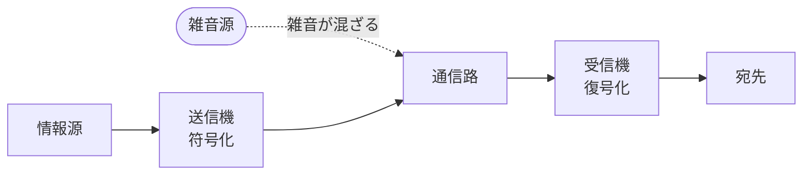
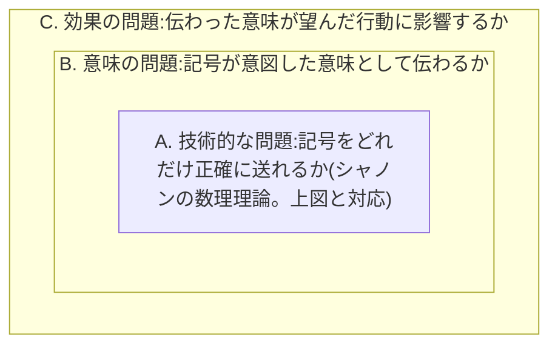
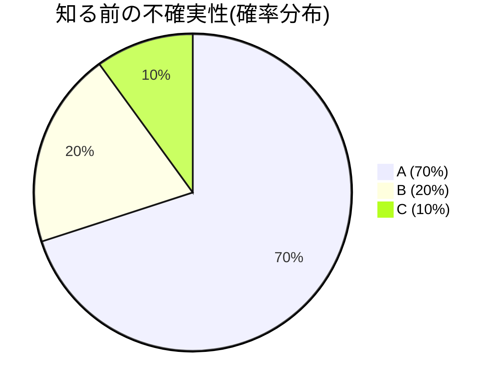
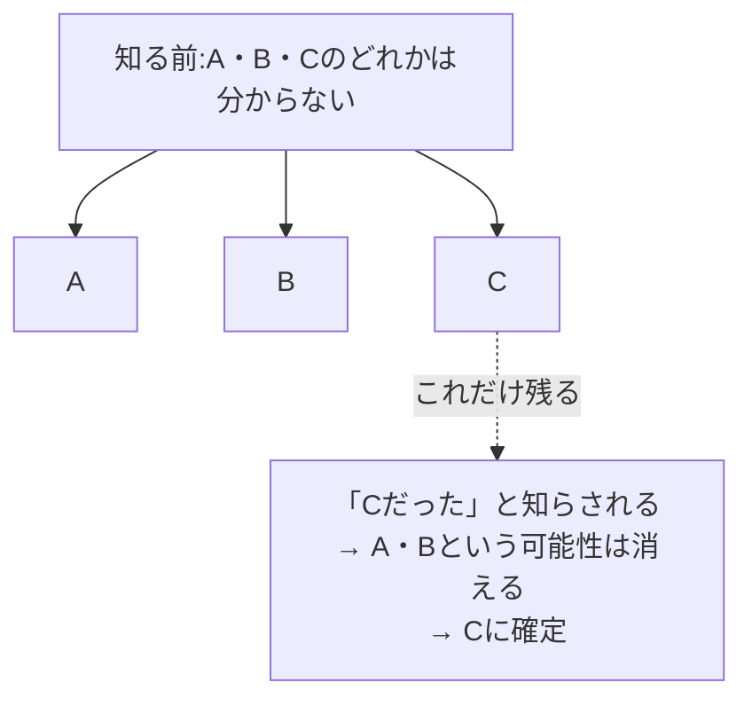
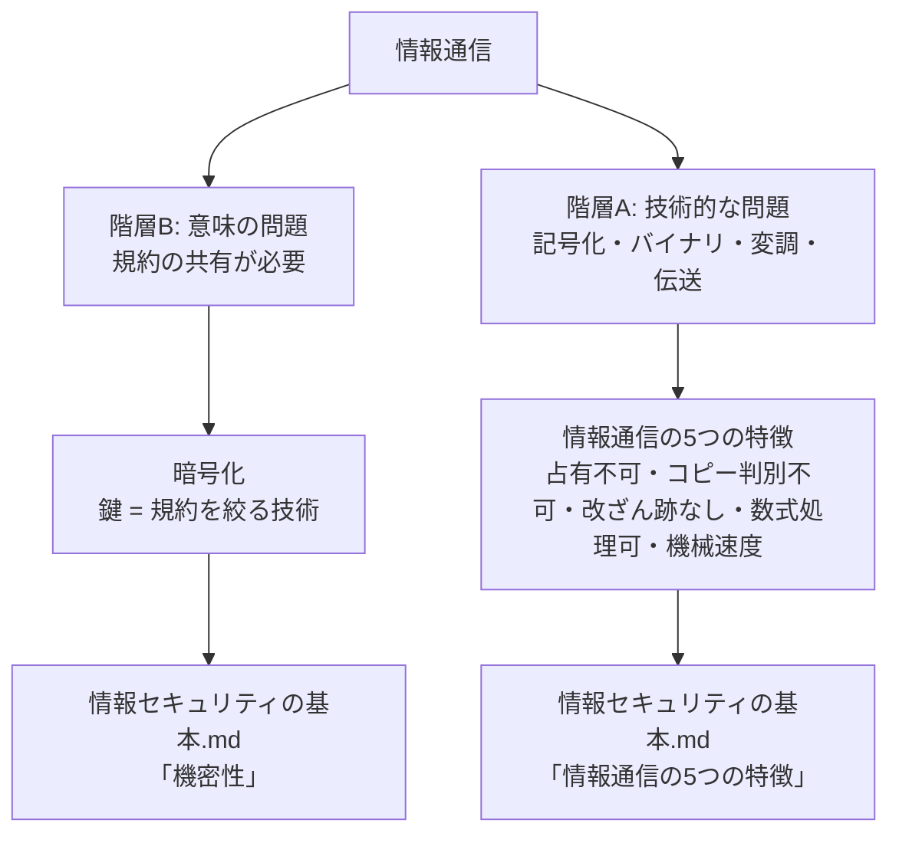

# 情報と通信の基礎

- カテゴリ: 情報工学
- 最終更新: 2026-06-20

---

## 通信には2つの階層がある

これは思いつきの分類ではなく、情報理論の出典がある、確立された枠組み。

クロード・シャノンが1948年に発表した論文「A Mathematical Theory of Communication」(Bell System Technical Journal)が、現在のデジタル通信工学(符号化、伝送、圧縮、誤り訂正など)すべての土台になっている、事実上の標準理論。シャノンの理論は、情報源が何を意味しているか(「猫がいる」など)を一切考えず、送信機から受信機まで記号をどれだけ正確に・効率よく送れるかだけを数式で扱った。図にすると次のような構造。



この図の「通信路」に必ず雑音が入る、という前提を置き、雑音があっても元の記号をどれだけ正確に復元できるかを数式で扱ったのがシャノンの理論。ここから「ビット」という単位、エントロピー、通信路容量(チャンネルキャパシティ)といった概念が生まれた。

この論文が1949年に書籍化された際、序文を書いた数学者ウォーレン・ウィーバーが、通信という行為には実は3段階の別の問題が含まれている、という整理を示した。これは「シャノン=ウィーバーモデル」として、今も通信理論・情報理論の教科書で最初に紹介される基本的な枠組みになっている。

| 階層 | 問題 | 何を扱うか |
|---|---|---|
| A. 技術的な問題 | 記号をどれだけ正確に送れるか | ノイズ、伝送速度、符号化方式など |
| B. 意味の問題 | 送られた記号が、意図した意味として正確に伝わるか | 規約(コード)の共有、言語、解釈 |
| C. 効果の問題 | 伝わった意味が、望んだ通りに相手の行動に影響するか | 説得力、伝え方の効果など |

3つの階層は、互いに無関係に並んでいるのではなく、後の階層が前の階層を内包する入れ子構造になっている。



シャノン自身の数理理論(階層A、エントロピー・通信路容量・ビットという単位など)は、デジタル通信工学において事実上異論のない基礎理論として扱われている。一方、階層B・Cを含めた3階層全体の枠組みは、通信理論・メディア論の入門で必ず触れられる古典的な整理だが、その後の研究者から「フィードバックや文脈を扱えない」といった拡張・批判も受けている。それでも、通信という行為を分解して理解するための標準的な出発点であることに変わりはない。

このドキュメントは、階層Aと階層Bの基礎をそれぞれ整理する。階層Aは[情報セキュリティの基本](../セキュリティ/情報セキュリティの基本.md)で扱う「情報通信の5つの特徴」の前提になり、階層Bは同じドキュメントの「暗号化(鍵=規約を絞る技術)」の前提になる。

---

## 階層B:意味の問題 — 規約の共有

### 情報は媒体と分離できる。ただし、それには「規約の共有」という前提条件がある

「猫がいる」という情報は、声で話しても、紙に書いても、電気信号にしても、同じ情報として伝わる。これは、情報の中身(意味)が、それを運ぶ物理的な手段(媒体)とは別物であることを示している。情報は媒体と分離できる。

ただし、この分離が実際に機能するには、前提条件がある。**送信側と受信側が、同じ規約(符号化・復号化のルール)を共有していること**。

- 電気信号そのものは「猫がいる」という意味を持っていない。ただの電圧の変化(物理現象)に過ぎない。受け取った側が「この電圧パターンはこの文字に対応する」という規約を知っていて初めて、元の意味に戻せる
- 声(音波)も同じ。日本語を知らない人にとっては、「猫がいる」という音はただの音であり、情報にならない。日本語という規約を共有している人だけが、その音から意味を取り出せる

つまり、「情報は媒体と分離できる」というのは情報そのものの性質であり、これは正しい。一方で、その情報を別の媒体(声→紙→電気信号)に乗せ替えても、受信側が実際に元の意味を復元できるかどうかは別の話で、そこには「規約の共有」という追加の条件が要る。声も文字も電気信号も、最終的に同じ規約(日本語という言語、文字コードなど)に対応づけられていて、送信側と受信側がその規約を共有しているからこそ、同じ情報として伝わる。規約を共有していなければ、同じ物理現象を受け取っても情報としては伝わらない。

この規約の共有という考え方は、[情報セキュリティの基本](../セキュリティ/情報セキュリティの基本.md)の機密性(暗号化)の説明の前提になっている。暗号化の「鍵」は、この規約の一種。規約をできるだけ多くの人と共有すれば誰にでも情報が伝わり、逆に特定の人だけに絞れば、その人にしか情報が伝わらなくなる。

---

## 階層A:技術的な問題 — 記号化と伝送

### どんな情報も、記号の並びとして表現できる

声、文字、画像、音楽、どんな種類の情報でも、最終的には「記号の並び」として書き出せる。これは20世紀半ばにクロード・シャノンが情報理論として整理した内容で、「情報の正体は、いくつかの選択肢の中からどれが選ばれたか、という選択の積み重ねである」という捉え方をする。

### 情報量を測る式を、段階を踏んで導く

#### ステップ1:情報量とは、不確実性が減った量である

「情報を受け取る」とは、それまで分からなかったこと(不確実性)が、分かる状態に変わることだと考える。出来事を知らされる前は、いくつかの可能性があった。知らされた後は、その中の1つに決まる。この「減った不確実性の量」を、情報量として測りたい。

知る前の確率分布(A:70%, B:20%, C:10%)を円グラフにすると、この「広がり」が不確実性の大きさそのものを表す。



ここで「Aが起きた」と知らされると、もともと70%(大部分)を占めていたAに絞られるので、絞り込まれた量(情報量)は小さい(予想通り、驚きが少ない)。「Cが起きた」と知らされると、もともと10%(ごく一部)だったCに絞られるので、絞り込まれた量(情報量)は大きい(意外、驚きが大きい)。

これをYes/Noの質問の木(分岐)として見ると、同じことが言える。



知る前の「広がり(複数の分岐)」が、知った後に「1点」へ絞り込まれる、その絞り込まれた量が情報量、というイメージ。

#### ステップ2:測る関数が満たすべき、自然な条件を挙げる

不確実性の減少量を表す関数 I(p)(pはその出来事が起きる確率)が、常識的に満たしているべき性質を考える。

1. 情報量は負にならない: I(p) ≥ 0
2. 確実な出来事(p=1)を知らされても、何も新しく分からない: I(1) = 0
3. 珍しい出来事(pが小さい)ほど、情報量は大きい: pが小さいほどI(p)は大きい
4. 無関係な出来事が2つ起きたとき、情報量は足し算になるべき: pとqが無関係(独立)な出来事の確率なら、両方起きる確率はp×qで、I(p×q) = I(p) + I(q)になってほしい

#### ステップ3:条件4が、対数を使うことをほぼ強制する

条件4は「掛け算を入力すると、足し算を出力する関数を見つけよ」という問題になる。p = e^u, q = e^v と置き換えると、I(p×q) = I(p) + I(q) は g(u+v) = g(u) + g(v)(g(u) = I(e^u))という単純な形になり、これを満たす関数(連続・単調という常識的な条件のもとで)は、g(u) = c×u(直線)しかないことが数学的に分かっている。これを戻すと I(p) = c × log(p) という形になる。つまり「対数を使えば便利そうだから」ではなく、**条件4(無関係な出来事は足し算)を満たそうとすると、対数しか選択肢が残らない**。

#### ステップ4:符号と単位を決める

pは0〜1の範囲なので、log(p)は負の値になる。条件1(負にならない)・条件3(pが小さいほど大きい)を満たすには、cを負の数にする必要がある。さらに「公平なコイン(p=0.5)の情報量を、ちょうど1にしたい」という最も基本的な基準を採用すると、対数の底を2にするのが自然になる。これで

```
I(x) = -log2( P(x) )
```

という式が決まる。

#### ステップ5:この式が「都合のいい寄せ集め」ではないか、を確かめる

ここまでは「望ましい性質を満たす関数を探した」という話で、それ自体が妥当かという疑問が残る。これを確かめるには、**具体的な作業に基づいた、別の角度からの定義**を考えるとよい。

情報量を、ある出来事xを「Yes/Noの質問」で特定するときに、最も効率の良い質問の仕方をした場合に必要な、平均的な質問回数として定義してみる。

- 選択肢が1つしかない(確実な出来事)なら、質問する必要が最初から無い → 情報量は0。これは「0にしてほしい」という願望ではなく、質問という具体的な作業の事実
- 効率の良い質問戦略では、よく起きることほど浅い場所(少ない質問数)に置き、珍しいことほど深い場所(多い質問数)に置くのが最適になる → 確率が低いほど情報量が大きい、という条件も、願望ではなく質問戦略の構造からくる事実

#### ステップ6:この「質問回数」が、本当に -log2(p) になるか、計算で確かめる

Yes/Noの質問(二分木)で出来事を特定する場合、クラフトの不等式(質問の木が矛盾なく機能するための制約)という条件のもとで、平均質問回数を最小化する問題を解くと、最適解が

```
l(x) = -log2( P(x) )
```

になることが、数学的に証明できる(ラグランジュの未定乗数法という最適化の手法を使う)。つまり「-log2(p)が最適なはずだ」という予想ではなく、**平均質問回数を最小化する、という具体的な最適化問題を解いた結果として、同じ式が出てくる**。

#### ステップ7:全く違う角度からの議論が、同じ式に収束するか確認する

ステップ2〜4(望ましい性質からの導出)と、ステップ5〜6(質問回数の最適化からの導出)という、出発点の違う2つのアプローチが、同じ式 I(x) = -log2(P(x)) に行き着いた。さらに、

- 等確率の出来事がN個あるケース(N=8など)では、この式が log2(N) になり、シャノンより20年前にラルフ・ハートレーが提案していた式と一致する
- ギャンブルで資産を最大の速さで増やす最適な戦略(ケリー基準)を計算しても、同じ形の式が出てくる
- 19世紀の統計力学(気体分子の「乱雑さ」を数える、通信とは無関係な物理の問題)で使われるボルツマンのエントロピーの式も、数学的に完全に同じ形をしている

互いに無関係な複数のアプローチが、同じ式に収束していることが、この式が「都合よく作られたもの」ではなく、何か本質的な量を正しく捉えていることの根拠になる。

### エントロピー:出来事全体での平均情報量

I(x)は1つの出来事の情報量。これを、その出来事が実際に起きる確率で重み付けして平均したものが、エントロピー。

```
H(X) = Σ P(x) × I(x) = -Σ P(x) × log2( P(x) )
```

### 確率分布そのものが、「あらかじめ共有されている文脈」である

確率P(x)は、「これから何が起きそうか」という、事前の期待・予想を数値化したものだと捉えられる。実際に出来事が起きて知らされたとき、新たに認識すべき情報量は、**その事前の期待(文脈)からどれだけズレていたか**で決まる。期待通り(確率が高い)ならズレは小さく情報量も小さい。期待外(確率が低い)ならズレが大きく情報量も大きい。つまり情報量とは、「あらかじめ共有されている文脈(確率分布という期待)と、実際の結果との差分」だと言える。

これは、前に出てきた「階層B:規約の共有」(記号が何を意味するか、という取り決め)とは別の、もう1つの「共有」にあたる。

| 種類 | 何を共有するか | 役割 |
|---|---|---|
| 階層Bの規約 | 記号が何を意味するか(符号化のルール、言語) | 記号を、正しい意味に復元するため |
| 確率分布(期待・文脈) | 何がどれくらい起こりやすいか | 情報量を測り、効率よく符号化するため |

この「確率分布の共有」は理論上の前提にとどまらず、実際の圧縮技術でも現実に必要とされている。ハフマン符号化のような圧縮は、送信側と受信側が同じ確率分布(文脈)を前提にしていることに依存している。受信側が想定している確率分布と、実際の情報源の確率分布がズレていれば、圧縮の効率は落ちる(想定と違う出来事には、効率的な短い符号が用意されておらず、長い符号になってしまう)。

### この「質問回数」の話自体が、規約の共有(階層B)を前提にしている

「Yes/Noの質問で特定する」という説明には、見落としやすい前提がある。受け取った記号が「Yes, No, Yes」だったとしても、**どの質問に対する答えだったか(=どの質問の木を使ったか)を、送信側と受信側が事前に共有していなければ、その記号の並びは意味を持たない**。

つまり、エントロピーや「質問回数」という階層Aの話は、「規約(質問の木)がすでに共有されている」ということを暗黙の前提にした上で、「その前提のもとで、最小限どれだけの記号が必要か」を計算しているに過ぎない。規約をどう共有するか自体は、階層Aの理論が答えていない、階層Bの問題。シャノンは自分の数理理論を作るとき、この階層Bの問題を意図的に範囲外にして、階層Aだけを扱った。

実際のデータ圧縮技術でも、これは現実の課題として現れる。ハフマン符号化では、「どの記号にどの質問の木(符号)を割り当てたか」という対応表(辞書)を送信側と受信側が共有していないと、圧縮されたデータを元に戻せない。対応表自体をデータと一緒に送る場合もあれば、標準規格としてあらかじめ決めておき、毎回送らずに済むようにする場合もある。

### なぜ「0と1」(2種類)が選ばれたのか

記号の種類は2つでなくても理論上は成立する(10進数でも、もっと多い種類の記号でも可能)。しかし2種類(電圧が高いか低いか、光があるか無いか、磁気の向きがどちらか)を区別する仕組みは、3種類以上を正確に区別する仕組みよりも圧倒的に作りやすく、ノイズ(電気的な揺れや劣化)があっても誤読しにくい。

- 例: 「高い/低い」の2択なら、多少の電圧のブレがあっても「だいたいどちらか」は判定しやすい
- 「10段階の電圧」を正確に区別しようとすると、わずかなブレで読み間違いが起きやすくなる

この「区別のしやすさ・壊れにくさ」が、コンピュータや通信のほぼ全てで2進数(バイナリ)が採用されている理由。

### これは、シャノンの図の「雑音」への対策そのもの

「電圧のブレ」は、まさにシャノンの通信モデルの「雑音源」が通信路に混ぜ込んでくるものそのもの。送信機が信号を送り出し、通信路を通る間に雑音が混ざり、受信機は「混ざった後の電圧」を見て元の記号を判定する。記号の区別に使う電圧の段階を何段階にするかが、雑音への耐性を左右する。

- **2段階(高い/低い)の場合**: 「高い」と「低い」の間に大きな差(マージン)を取れる。雑音で多少電圧がブレても、まだどちらか側に収まりやすい
- **10段階の場合**: 隣り合う段階の差が狭くなる。同じ大きさの雑音でも、隣の段階と誤認しやすくなる

つまり「2種類の記号を使う」という選択自体が、**同じ雑音の大きさに対して誤判定が起きる確率を下げる**ための設計判断になっている。これは雑音マージン(noise margin)、信号対雑音比(SNR: Signal-to-Noise Ratio)という言葉で説明される考え方で、シャノンの通信路符号化定理(雑音がある通信路で、どれだけ正確に記号を送れるかの限界を示す定理)に直接対応している。バイナリは、「誤りにくさ」と「1回の送信で送れる情報量」のバランスの中で、誤りにくさを優先した選択肢だと言える。

### 記号を、実際の物理現象に対応させる

「0」「1」という抽象的な記号を、実際に存在する物理現象(電圧の高低、光の点滅、電波の振幅や周波数の違いなど)に対応させることで、初めて記号を実際に送ったり保存したりできるようになる。これを「変調」「符号化」と呼ぶ。

### 通信とは、その物理現象を送信側から受信側まで伝えること

信号(電気、光、電波)を、ケーブルや空間といった「媒体」を通して、送信側の場所から受信側の場所まで届けること。これが通信の定義。

---

## まとめ:2つの階層から、それぞれ別の話につながる



階層Aと階層Bは、シャノン自身が階層Bを意図的に範囲外にして数理理論を組み立てたという経緯もあり、別々の問題として扱われる。このドキュメントでは両方を基礎として整理し、それぞれが[情報セキュリティの基本](../セキュリティ/情報セキュリティの基本.md)のどの部分につながるかを示した。
